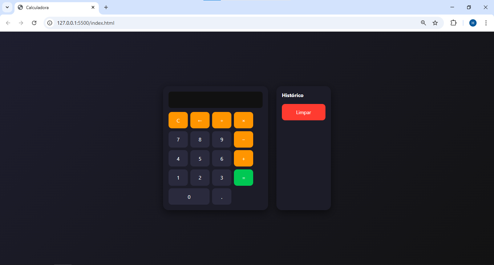
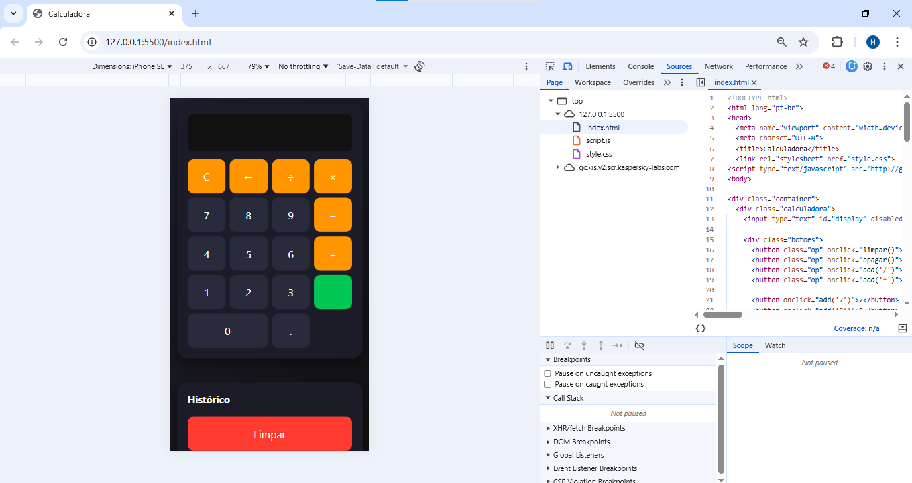

# Calculadora Web Interativa

Projeto de uma calculadora web moderna desenvolvida com **JavaScript puro**, com foco em lógica de programação, manipulação do DOM e boas práticas de desenvolvimento.

---

## Demonstração

  

  

---

## Funcionalidades

* ✔️ Operações matemáticas básicas (+, −, ×, ÷)
* ✔️ Respeito à prioridade de operações (* e / antes de + e -)
* ✔️ Suporte completo ao teclado
* ✔️ Prevenção de entradas inválidas
* ✔️ Histórico de cálculos em tempo real
* ✔️ Layout moderno e responsivo (mobile + desktop)
* ✔️ Comportamento inteligente (continuação de cálculos)
* ✔️ Implementação sem uso de `eval()` (mais seguro)

---

## Aprendizados

Durante o desenvolvimento deste projeto, foram praticados:

* Manipulação de DOM com JavaScript
* Estruturação de lógica de cálculo manual
* Uso de expressões regulares (RegEx)
* Tratamento de erros e validações
* Organização de código e boas práticas
* Responsividade com CSS

---

## Tecnologias utilizadas

* HTML5
* CSS3
* JavaScript (Vanilla JS)

---

## Como executar o projeto

1. Clone o repositório:

git clone https://github.com/Hugofsantoss/calculadora-js.git

2. Acesse a pasta:

cd calculadora-js

3. Abra o arquivo:

index.html

---

## Estrutura do projeto

   calculadora-js
 ├── index.html
 ├── style.css
 └── script.js

---

## Melhorias futuras

 [ ] Histórico clicável
 [ ] Persistência com LocalStorage
 [ ] Suporte a parênteses
 [ ] Tema claro/escuro
 [ ] Transformar em aplicação fullstack

---

## Autor

Desenvolvido por Hugo.

---

## Observação

Este projeto foi desenvolvido com fins educacionais e faz parte do meu portfólio como desenvolvedor em formação.

---